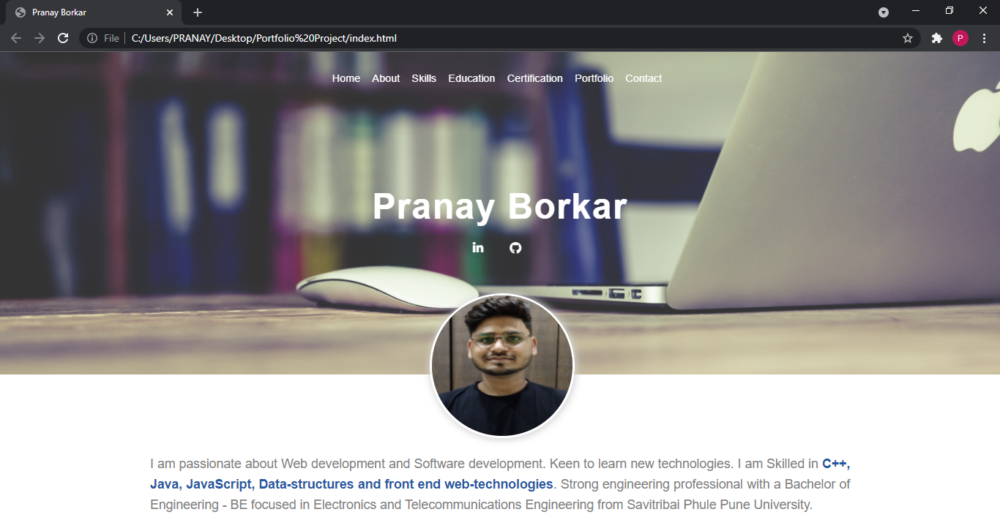
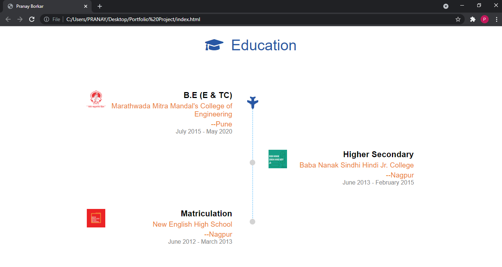

# portfolio-project

<h3 align="center">The Responsive portfolio website project is made using HTML, CSS and
Javascript. The website contains different sections that shows the
information about my skills , education and certifications.</h3>

  <h3> Introduction Section </h3>
  
  <h3> Skills Section </h3>
  
  <h3> Certificate Section </h3>
  
  <h3> Education Section</h3>
  
  <h3> Contact Section</h3>
  
  
  

